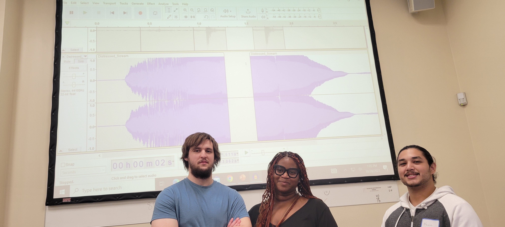

# MonsterMakey

## About
Monster Makey is a project about using sound audio for storytelling. The project is used to engage students and show how to edit audio in a software called, Audacity and how to produce sound through a technology called, Makey Makey. Our target audience is students who would be interested in STEM and possibly be interested in the TAP program. TAP is a Technology Ambassadors Program for students who are interested in Information Technology; the program lets students learn more about different technologies during their fun project [TAP Link](https://www.ggc.edu/academics/school-of-science-and-technology/research-internships-service-learning/technology-ambassador-program). Here is a link to our project demo [Monster Makey Demo](Media/ProjectDemo.md).

## Students
Samuel Downs,
Jasmine Roach,
Kevin Rubio (from Left to Right)

Advisers: Dr.Robertson and Dr.Anca

## Publications

## Outreach Activities

## Technology
The technology our project used was Audacity and Makey Makey. Audacity is a free open-source software for editing different audio. Makey Makey is a small circuit board that can hook up to any computer and use wire to hook to any item that can be used to conduct electricity.

## Project setup/Installation
1. Login to each computer in classroom.
2. Placed one set of Halloween Stories on every two computers.
3. Use a flash drive to add unedited sounds, scratch files of Halloween stories, and presentation sounds.
4. Plug Makey Makey to computer
5. Add wire to different parts of the Makey Makey
6. Add Play-Doh to the ends of the wires.  

## Usage

