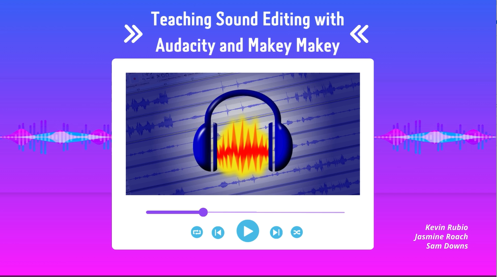

# Teaching Sound Editing with Audacity and Makey Makey 
## About
Monster Makey is a project about using sound audio for storytelling. The project is used to engage students and show how to edit audio in a software called, Audacity and how to produce sound through a technology called, Makey Makey. Our target audience is students who would be interested in STEM and possibly be interested in the TAP program. TAP is a [Technology Ambassadors Program](https://www.ggc.edu/academics/school-of-science-and-technology/research-internships-service-learning/technology-ambassador-program) for students who are interested in Information Technology; the program lets students learn more about different technologies during their fun project. 

## Description
1. Dificulty Level: Easy
2. Target Audience: Middle school to college students
3. Duration: 1 hour
4. Materials Needed: Makey Makey, Horror Stories (Provided), Audacity (Free), Playdough
5. Learning Outcomes: Students will learn new technologies such as Makey Makey and Audacity. Basic sound editing skills will be taught.
6. The goal of this study is to introduce students to recording and editing sound files through a fun and interactive horror story Mad Lib activity. Our project includes narrative stories that feature sound effects and activated by the reader pushing a button to produce a given sound effect. These buttons were created using an interactive controller, Makey Makey, to accept input into a program we created in Scratch, a block coding website, to allow participants to produce sounds.
7. The TAP program is a program for anyone with an interest in Information Technology. The program lets students learn more about different technologies while creating outreach workshops to promote an interest in STEM in their community. The creation and implementation of these workshops will allow TAP students to develop better communication and leadership skills while also letting students be creative in designing their projects. The TAP program promotes the acquisition of research skills and encourages students to attend conferences to present their projects. Student would then move onto editing and creating their own sounds through Audacity.
8. Monster Makey Project Teaser Video (click on the image)

## Team
* Samuel Downs
* Jasmine Roach
* Kevin Rubio (from Left to Right
  

## Advisors 
* Dr. CindyRobertson
* Dr. Anca Doloc-Mihu

## Publications
1. Teaching Sound Editing with Audacity and Makey Makey, Consortium for Computing Sciences in Colleges- Jasmine Roach, Kevin Rubio, Sam Downs, Anca Doloc Mihu, Cindy Robertson. Southeastern Region (CCSC: SE), November 2-4, 2023, Myrtle Beach, SC.
2. Samuel Downs, Jasmine Roach, Kevin Rubio. (November 30, 2023) Teaching Sound Editing with Audacity and Makey Makey, Consortium for Computing Sciences in Colleges. CREATE Symposium, Lawrenceville, Ga.
3. “Teaching Sound Editing with Audacity and Makey Makey” - Kevin Rubio, Sam Downs, Jasmine Roach, Anca Doloc Mihu, Cindy Robertson. ACM Southeast (ACMSE) Conference, 2024, Kennesaw State University, April 18-20, 2024.

## Outreach Activities
1. TAP Expo, Oct 10, 2023, Georgia Gwinnett College: To promote the IT field and the TAP program to college students.
2. Super Saturday Series, Oct 28, 2023, Georgia Gwinnett College: Project demo to middle and high school girls to promote IT and STEM careers.
3. 3 Class Workshops, Oct 26, 2023, and Nov 10, 2023, Georgia Gwinnett College: Project demo to college students to be interested in the TAP program or IT major.
4. CREATE Symposium, Nov 30, 2023, Georgia Gwinnett College: Project demo and poster presentation at research event.

## Technology
Our project includes narrative stories that feature sound effects created in Audacity and activated by the reader pushing a button to produce a given sound effect. These buttons were created using an interactive controller, Makey Makey, to accept input into a program we created in Scratch, a block coding website, to allow participants to produce sounds.

### Audacity
Audacity is a free and open-source digital audio editor and recording application software.
| || 
| :-----------------------------------------------------------: | :-----------------------------------------------------------------------------------------------------------------: | :-------------------------------------------------------------: | 
|<a href = "https://www.audacityteam.org">Audacity</a>|<a href = "https://makeymakey.com">Makey Makey</a>|<a href = "https://scratch.mit.edu">Scratch</a>|

## Project setup/Installation
[Project Setup.pdf](https://github.com/TAP-GGC/MonsterMakey/files/14656855/Project.Setup.pdf)

## Short Demo Instructions
[Monster Makey Demo Instructions.pdf](https://github.com/TAP-GGC/MonsterMakey/files/14655509/Monster.Makey.Demo.Instructions.pdf)

## Workshop Instructions
[Workshop Instructions.pdf](https://github.com/TAP-GGC/MonsterMakey/files/14729146/Workshop.Instructions.pdf)

## Workshop Video
[Workshop Video](https://youtu.be/Ld8yQ3rw0JY?si=VjPyTTgM8oEz1B_e)
